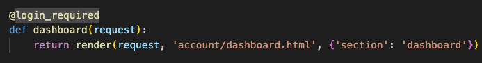

# Inventor Blog - [Live Website](https://cad-tips.herokuapp.com/)

https://github.com/DavidHearl/cad-tips

## About
---

CAD Tips is a fully responsive blog where users can come to learn how to use Autodesk Inventor.
The user will find helpful posts and examples which they can complete to increase their skill!

## User Stories
---

### Admin

- As an Admin I want to create, read, update and delete posts so that I can manage my blog content.
- As an Admin I want to create draft posts so that I can take more time to create content.
- As an Admin I want to remove comments so that I can filter content on the website.

### User

- As a site User I want to view comments on the article so I can read the conversation and get more knowledge.
- As a Site User I want to register an account so that I can comment.
- As a Site User I want to leave a comment on a post so that I can be involved in a conversation.
- As a Site User I want to delete my comment so that I can remove any errors that I have made
- As a site User I want to be able to update my profile information so that my details stay correct.

### Visitor

- As a visitor I want to see a list of posts so that I can select the post I would like to read.
- As a visitor I want to click on a post so that I can read the full content as see all the information.
- As a visitor I want to be able to share a post so that I can share content with with friends & colleagues.

## Agile Development Tool
---

For the agile methodology I used the GitHub canban board, it was here where I created the user stories, first as a draft then progressed the items to issues in the to do column. You can see a snap shot below.

When I wanted to start working on a feature, I moved the issue from the 'todo' list to the 'in progress' list. Once the task was completed it was moved in to the completed list.

Below is a snapshot of the completed canban board.

The user stories detailed above are aligned with the project goals. Which was to produce an informative blog that people could use to imporve their knowledge of 3D CAD.

## Design
---
It was important for me to try and keep the styling consitent with the style found in Autodesk Inventor, the main application this blog is based off.

In 2019 Autodesk previewed a 'dark' mode which 80% of the userbased have migrated to, because of this I decided it was important to keep the dark theme that has become so prevelant.

The color pallette found in Autodesk Inventor tends to sway more towards the 'blue' spectrum. As my objective was to follow the style and not copy it I decided to lean towards the blue hue but not go as far as they have.

The color combination I used are as follows:
- rgb(10, 15, 20) : Headers
- rgb(20, 24, 30) : Background
- rgb(30, 34, 40) : Body Backgrounds
- rgb(50, 55, 60) : Subtle Borders
- rgb(100, 100, 100) : Defined Borders

The key element of the main design was to keep it simplistic with no 'nonsense' as it is a site used to easily convey information.

There has been a slight deviation from the initial conception. When blog posts were added to the main list view page it was
apparent that the side by side design on larger screens did not work. With the descriptions varying in length the posts became staggered. This made the posts incredibly hard to read. It was then decided to progress with the mobile format across all screen sizes
as it was the easiest format to consume information.

Another minor pivot was to change the pagination value from 8 to 6. 8 blogs per page did appear to make the blog more cluttered. With that being said the two styles may be tested in the coming weeks across the user base to determine which pagination value the users prefered.

The aim of the post detail view was to keep the post as clear and concise as possible. That is why there is only a minimal title and the comment section is out of the way at the bottom of the page.

## Testing
---
### Code Validation
--- 

All Python files passed PEP8 validation through http://pep8online.com. See below the list of files that have been validated.
- blog/admin.py - Passed
- blog/apps.py - Passed
- blog/forms.py - Passed
- blog/models.py - Passed
- blog/urls.py - Passed
- blog/views.py - Passed
- cad_tips/urls.py - Passed

All HTML Templates passed HTML validation through https://validator.w3.org/
All CSS Templates passed CSS validation through https://jigsaw.w3.org/css-validator/validator.html.en

It should be noted that the CSS validation does highlight some errors, although they are all in the bootstrap file system.

### Responsive Testing

#### Post List : Desktop & Mobile

#### Post Detail : Desktop & Mobile

#### Comment : Desktop & Mobile

### Testing Views

For the views tests to be successful all the views need to return the correct pages. Manually testing each view, it can be observed that all views (listed below) all return the correct template.

- Post List - Correct

- Post Detail - Correct

- Post Share - Correct

- User Login - Correct

- Register - Correct

- Delete Comment - Correct

- Edit Profile - Correct

- Dashboard - Correct

### Testing Features

New user can register - Passed
User can login - Passed
User can logout - Passed
User can leave comment - Passed
User can delete their own comment - Passed
User cannot delete someone else's comment - Passed (Delete button does not appear)
User can edit their profile information - Passed
User can share post - Failed (See issue 1 in the section below)
User can change their password - Failed (See issue 2 in the section below)

## Issues
---

1. As the emails are not sent using a local SMTP server but instead a google account there may be some issues. 
Google sometimes blocks the ability to log into google with a 3rd part application, as a fallback emails will be logged to the console.

2. There is an issue with the redirect path for the change password link. It will change the password for the user if it is asked, however it will not redirect the user back to the website. If the page is refreshed the page should take you back to the home page. I am currently unsure of how to fix this issue

## Additional Features Comming Soon

- Add the ability to like posts
- Add the comment count and likes to the list post
- Add the ability to edit a comment
- Add a view to add posts
- Add a view to edit posts

## Pass Criteria
---

| Number | Marking Criteria | Met |
|:-:|:----------|:---:|
|1.1|Design a Front-End for a data-driven web application that meets accessibility guidelines, follows the principles of UX design, meets its given purpose and provides a set of user interactions.|x|
|1.2|Implement custom HTML and CSS code to create a responsive Full-Stack application consisting of one or more HTML pages with relevant responses to user actions and a set of data manipulation functions|x|
|1.3|Build a database-backed MVC web application that allows users to store and manipulate data records about a particular domain.|x|
|1.4|Design a database structure relevant for your domain, consisting of a minimum of one custom model.|x|
|1.5|Use an Agile tool to manage the planning and implementation of all significant functionality|x|
|1.6|Document and implement all User Stories and map them to the project within an Agile tool|x|
|1.7|Write Python code that is consistent in style and conforms to the PEP8 style guide and validated HTML and CSS code.|x|
|1.8|Include sufficient custom Python logic to demonstrate your proficiency in the language|x|
|1.9|Include functions with compound statements such as if conditions and/or loops in your Python code|x|
|1.10|Write code that meets minimum standards for readability (comments, indentation, consistent and meaningful naming conventions).|x|
|1.11|Name files consistently and descriptively, without spaces or capitalisation to allow for cross-platform compatibility.|x|
|1.12|Document and implement all User Stories within the Agile tool and map them to the project goals|x|
|1.13|Document the UX design work undertaken for this project, including any wireframes, mockups, diagrams, etc.,created as part of the design process and its reasoning. Include diagrams created as part of the design process and demonstrate that these have been followed through to implementation|x|
|2.1|Develop the model into a usable database where data is stored in a consistent and well-organised manner.|x|
|2.2|Create functionality for users to create, locate, display, edit and delete records|x|
|2.3|All changes to the data should be notified to relevant user|x|
|2.4|Implement at least one form, with validation, that allows users to create and edit models in the backend|x|
|3.1|Apply role-based login and registration functionality|x|
|3.2|The current login state is reflected to the user|x|
|3.3|Users should not be permitted to access restricted content or functionality prior to role-based login.|x|
|4.1|Design and implement manual and/or automated Python test procedures to assess functionality, usability, responsiveness and data management within the entire web application|x|
|4.2|Design and implement manual and/or automated JavaScript test procedures to assess functionality,usability, responsiveness and data management within the entire web application|x|
|4.3|Document all implemented testing in the README.|x|
|5.1|Use Git & GitHub for version control of a Full-Stack web application up to deployment, using commit messages to document the development process.|x|
|5.2|Commit final code that is free of any passwords or security-sensitive information to the repository and the hosting platform|x|
|6.1|Deploy a final version of the Full-Stack application code to a cloud-based hosting platform and test to ensure it matches the development version|x|
|6.2|Ensure that the final deployed code is free of commented out code and has no broken internal links|x|
|6.3|Document the deployment process in a README file in English|x|
|6.4|Ensure the security of the deployed version, making sure to not include any passwords in the git repository, that all secret keys are hidden in environment variables or in files that are in .gitignore, and that DEBUG mode is turned off|x|
|7.1|Design a custom data model that fits the purpose of the project|x|

## Deployment
---

1. Login to Heroku and Create a New App
2. Create a name for your app, It must be unique name (not just unique for your heroku projects)
3. Click "Create App" then select a region, either Europe or United States
4. Next, navigate to the 'Resources' tab. Move down to the add-ons section then in the box and search for 'Heroku Postgres', add the Heroku Postgres database to the project.
5. Next, navigate to the 'Settings' tab at the top of the page.
6. Scroll down to Config Vars (also known as Environment Variables, hence env.py) then click 'Reveal Config Vars'.
7. Create 4 config vars ['CLOUDINARY_URL', 'DATABASE_URL', 'SECRET_KEY', 'DISABLE_COLLECTSTATIC']
8. The values of the first 3 variables then have to be mirrored in the env.py file (Make sure the env.py referenced in the .gitignore file)
9. In the settings.py file we need to import os, import dj_database_url and then create an if statement to import the env.py file.
10. In the setttings.py file you also need to replace the insecure secret key with the one you made up
11. Scroll down and comment out the current database and past this code in DATABASES = { 'default': dj_database_url.parse(os.environ.get('DATABASE_URL')) }
12. Update the 'INSTALLED_APPS' list with 'cloudinary' and 'cloudinary_storage'
13. In the settings.py file add:
 - STATIC_URL = '/static/'
 - STATICFILES_STORAGE = 'cloudinary_storage.storage.StaticHashedCloudinaryStorage'
 - STATICFILES_DIRS = [os.path.join(BASE_DIR, 'static')]
 - STATIC_ROOT = os.path.join(BASE_DIR, 'staticfile')
 - MEDIA_URL = '/media/'
 - DEFAULT_FILE_STORAGE = 'cloudinary_storage.storage.MediaCloudinaryStorage'
14. You need to set the BASE_DIR to 'BASE_DIR = Path(file).resolve().parent.parent'
15. Then add 'TEMPLATE_DIR' to the Templates block
16. Now to deploy to heroku you need to install the heroku cli, so paste this command into the terminal: 'npm install -g heroku'
17. Once the CLI has been installed you can login with 'heroku loging -i'
18. Then type 'heroku git:clone -a 'app_name'
19. Add and Commit as you normally would. Then to push to heroku use: 'git push heroku main' or to push to git hub 'git push origin main'

## Requirements
---

- pip3 install django
- pip3 install dj_database_url
- pip3 install psycopg2-binary
- pip3 install dj3-cloudinary-storage
- pip3 install gunicorn
- pip3 install Pillow
- pip3 install django-summernote
- pip3 install django-crispy-forms
- pip3 install django-allauth

## Credits
---

This project was put together with the help of:

- Code Institute - I think before I blog
- Django 3 By Example - Antonio Mele
- Code Institute Tutors (Most noteably Scott)
